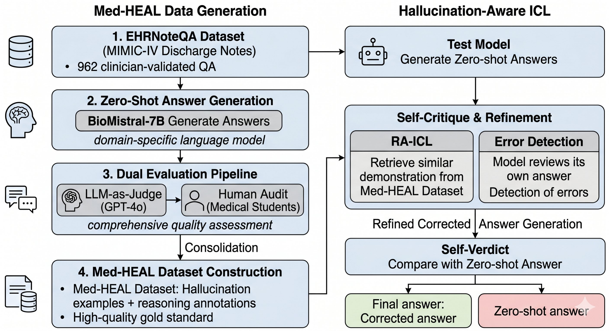

# Med-HEAL: Analyzing and Mitigating Hallucinations in Medical LLMs with Hallucination-Aware In-Context Learning

Code and data archive for the **ACM-BCB 2026** paper by Yiming Liao, Zeno Franco, Jose Eduardo Lizarraga Mazaba, and Keke Chen.

Med-HEAL builds a clinically-grounded hallucination dataset from EHRNoteQA (MIMIC-IV discharge summaries), with BioMistral-7B answers labeled by a dual GPT-4o LLM-as-a-Judge + medical-student auditing pipeline, and studies two training-free mitigations — model **self-critique with selective regeneration** and **retrieval-augmented in-context learning (RA-ICL)**. Across five open-source LLMs (BioMistral, Llama-3.1, DeepSeek, Qwen2.5, Qwen3), self-critique yields statistically significant accuracy gains for three of five models. This repository packages the prompts, baselines, judge, regeneration, and self-correction variants for reproducible deposit; see [Citation](#citation) to cite this work.



*Figure: the Med-HEAL pipeline — dataset construction with dual GPT-4o + human evaluation, then the training-free mitigations (self-critique regeneration and RA-ICL).*

## First Commands

```bash
python scripts/build_decision_matrix.py
python scripts/preflight.py
python scripts/run_all.py
```

Most runners print commands by default. Add `--execute` only after confirming
the chosen variant and server state.

Final clean-project preparation:

```bash
python scripts/prepare_clean_project.py
python scripts/run_final_project.py --smoke
```

`run_final_project.py` prints the full command set by default. Add `--execute`
only after the correct vLLM model is loaded for the requested model-specific
step.


## Dataset Start Point

The refactor starts from the existing processed artifact:

```text
../llm-ehr-hallucination/output/EHRNoteQA_processed.jsonl
```

Raw MIMIC-IV/EHRNoteQA preprocessing scripts are kept as provenance, not rerun by default. Downstream code should preserve the existing relative folder structure for folds, Step 8 outputs, Step 9 outputs, and refactor-local summaries.

## Variant Selection

Review:

```text
reports/VARIANT_DECISION_MATRIX.md
configs/default.json
```

Current defaults:

- baseline: `zeroshot`
- zero-shot generator: shared Step 8 script in the configured source repo, `src/step8_multimodel_icl/generate_step8.py`
- model order: BioMistral first, then Qwen2.5, Qwen3, DeepSeek, and Llama3
- judge: `gpt4o_stage1_binary_T0.1`, using the old Stage 1 binary prompt
- parser: `gpt-4o-mini`, text extraction only; no medical decision making
- self-correction: model-owned self-detection RA-ICL + verdict, plus model-owned regen + verdict

## Current Rerun Plan

The current working plan is documented in `reports/RERUN_AND_VALIDATION_PLAN.md`. Step 8 full-scale is the main repeatable experiment, and full-scale regeneration/self-correction is also in final-test scope. Method details such as embedding choice, prompt design, retrieval pool construction, judge/ground-truth policy, and true multirun design are still provisional and require validation tests before final rerun.

## Executing Runs

Baseline/RA-ICL/CoT generation:

```bash
python scripts/run_baselines.py --models qwen2.5-7b-instruct --conditions zeroshot cot_evidence --folds 0 --execute
```

Judge validation against human gold:

```bash
OPENAI_API_KEY=... python scripts/validate_judge.py --execute
```

Self-correction pilot:

```bash
python scripts/run_self_correction.py --variant step9_v2 --mode pilot --limit 5 --execute
```

Collect paired outcomes and run statistics:

```bash
python scripts/collect_paired_outcomes.py --glob "multi_model/qwen2.5-7b-instruct/audit.jsonl"
python scripts/run_stats.py output/paired_outcomes.csv
```

Expected paired outcome columns:

```text
fold,idx,patient_id,model,zeroshot_correct,final_correct
```

## Citation

If you use Med-HEAL, please cite:

```bibtex
@inproceedings{liao2026medheal,
  title     = {Med-HEAL: Analyzing and Mitigating Hallucinations in Medical LLMs with Hallucination-Aware In-Context Learning},
  author    = {Liao, Yiming and Franco, Zeno and Lizarraga Mazaba, Jose Eduardo and Chen, Keke},
  booktitle = {Proceedings of the ACM Conference on Bioinformatics, Computational Biology, and Health Informatics (ACM-BCB '26)},
  year      = {2026},
  address   = {Cosenza, Italy},
  publisher = {Association for Computing Machinery},
  doi       = {10.1145/3807503.3819453},
  url       = {https://doi.org/10.1145/3807503.3819453}
}
```

